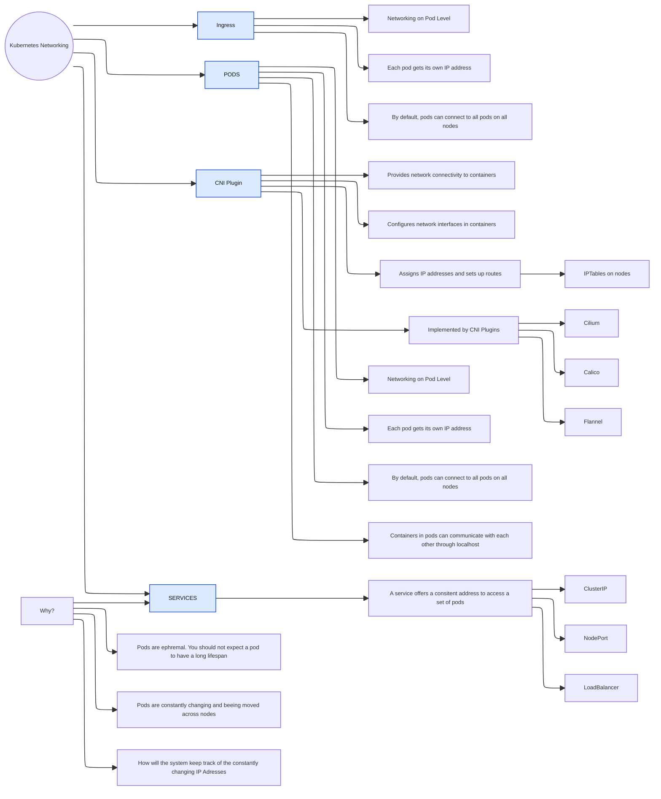
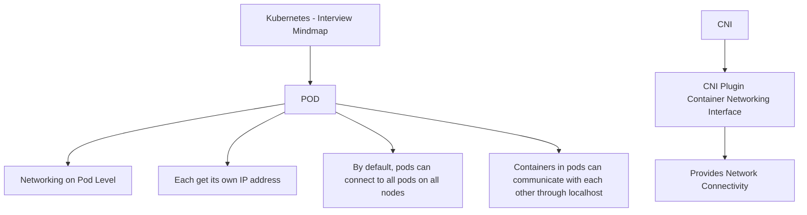

```mermaid
%%{init:{
	 'themeVariables': {  
	'fontSize': '9px'  
	},  
	'flowchart': {  
	'useMaxWidth': true,  
	'nodeSpacing': 80,  
	'rankSpacing': 180 
	},
  "flowchart":{
	    "defaultRenderer":"elk"
  }
}}%%

flowchart LR

%% INGRESS
INGRESS --> IngressNum1[Networking on Pod Level]
INGRESS --> IngressLevel1[Each pod gets its own IP address]
INGRESS --> IngressPodItem1[By default, pods can connect to all pods on all nodes]

Main --> PODS

%% Kubernetes Networking
Main --> INGRESS[Ingress]

Main((Kubernetes Networking))
Main --> CNI[CNI Plugin]
Main --> SERVICES

%%Container Networking Interface
CNI[CNI Plugin] --> Cni1[Provides network connectivity to containers]
CNI --> Cni2[Configures network interfaces in containers]
CNI --> Cni3[Assigns IP addresses and sets up routes]
Cni3 --> IPTABLES[IPTables on nodes]
CNI --> Cni4[Implemented by CNI Plugins]

Cni4 --> Cilium
Cni4 --> Calico
Cni4 --> Flannel


%% PODS
PODS --> PodItemNetwork[Networking on Pod Level]
PODS --> PodItemIP[Each pod gets its own IP address]
PODS --> PodItemAll[By default, pods can connect to all pods on all nodes]
PODS --> PodItemContainer[Containers in pods can communicate with each other through localhost]

%% SERVICES
SERVICES --> SERVICE[A service offers a consitent address to access a set of pods]
SERVICE --> ClusterIP
SERVICE --> NodePort
SERVICE --> LoadBalancer

%% WHYQ
WHYQ --> A[Pods are ephremal. You should not expect a pod to have a long lifespan]
WHYQ --> B[Pods are constantly changing and beeing moved across nodes]
WHYQ --> C[How will the system keep track of the constantly changing IP Adresses]
WHYQ[Why?] --> SERVICES

%% Styling
classDef infra fill:#dbeafe,stroke:#1d4ed8,color:#111;
classDef service fill:#dcfce7,stroke:#15803d,color:#111;
classDef external fill:#fef3c7,stroke:#d97706,color:#111;

class PODS,SERVICES,CNI,INGRESS infra;
class API,REP,REG,IDX,SEARCH,AUTH,WEB,VIEWER,TENANT,USERSVC,REND,RENDNET service;
class KROSS,GVD,GDA,KAFKA,GECO,DATASIGN,BUSTRA external;

```

```mermaid

graph TD
    K[Kubernetes - Interview Mindmap]
    
    %% POD
    K--> POD
    
    POD --> PODITEM1[Networking on Pod Level]
    POD --> PODITEM2[Each get its own IP address]
    POD --> PODITEM3[By default, pods can connect to all pods on all nodes]
    POD --> PODITEM4[Containers in pods can communicate with each other through localhost]
    
    %%CNI Plugin
    CNI--> CNIPlugin[
    CNI Plugin 
    Container Networking Interface
    ]
			
	CNIPlugin--> CNIITEM1[Provides Network Connectivity]
    
    
```