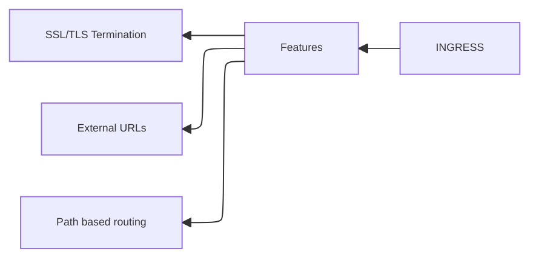

Anstatt Anwendung über IP Adressen aufzurufen, können mit Ingress FQDN (Fully Qualified Domain Names) genutzt werden.

Ingress ist eine Resource des Clusters die HTTP und HTTPS Routen von außerhalb des Clusters zu Services innerhalb des Clusters bereitstellt.

Der Cluster hört also auf eine bestimmte Domäne und hat eine Route so konfiguriert , dass er über diese Route einen Service im Cluster verknüpft.

#### Ingress Features:

Es können Pfade definiert werden für eine URI die, die dann auf bestimmte Services oder Pods geroutet werden.

![[Pasted image 20260609114118.png]]