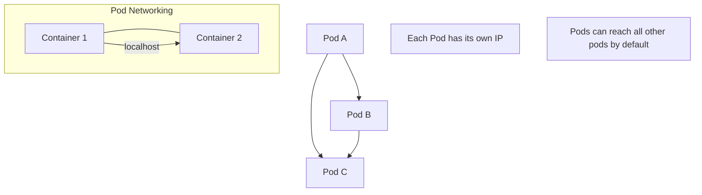

```mermaid

graph TD

A[Pod A] --> B[Pod B]
A --> C[Pod C]
B --> C

subgraph Pod Networking
    A1[Container 1] --- A2[Container 2]
    A1 -->|localhost| A2
end

note1[Each Pod has its own IP]
note2[Pods can reach all other pods by default]

```