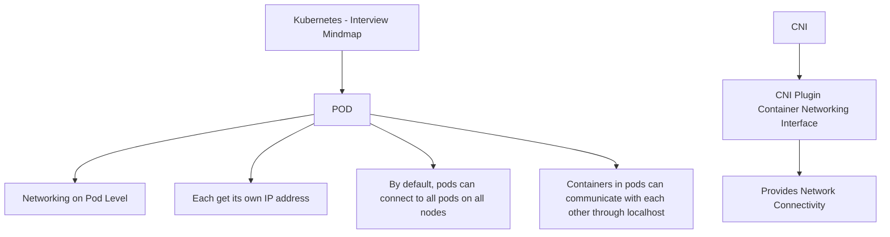

```mermaid

graph TD
    K[Kubernetes - Interview Mindmap]
    
    %% POD
    K--> POD
    
    POD --> PODITEM1[Networking on Pod Level]
    POD --> PODITEM2[Each get its own IP address]
    POD --> PODITEM3[By default, pods can connect to all pods on all nodes]
    POD --> PODITEM4[Containers in pods can communicate with each other through localhost]
    
    %%CNI Plugin
    CNI--> CNIPlugin[
    CNI Plugin 
    Container Networking Interface
    ]
			
	CNIPlugin--> CNIITEM1[Provides Network Connectivity]
    
    
```