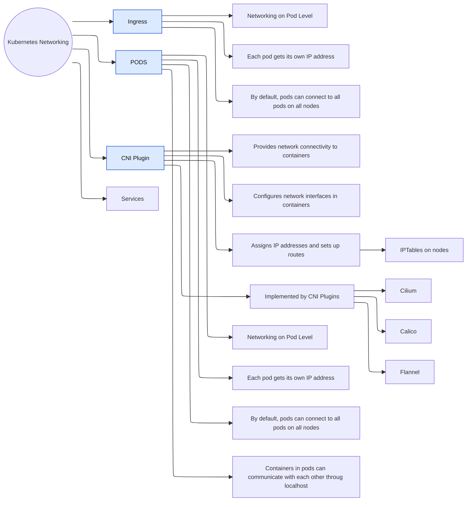

* Kubernetes hat einen Pool an IP Adressen
* jeder Pod bekommt seine eigene IP Adresse
* by default ist im Cluster jeder Pod per IP Adresse erreichbar
* mit Network Policies  kann die Kommunikation zwischen Pods und Namesspaces eingeschränkt werden
* wir können Pods als virtuelle Maschine betrachten ( mit mehreren Containern) und die Container kommunizieren untereinander über localhost
* Um Ports von aussen erreichen zu können http://localhost:9000 müssen wir den Port nach aussen weiterleiten

**Port Weiterleitung** 
k port-forward -n mealie pods/mealie-d78ff6bdd-cd999 9000

Was ist notwendig, um die PODS miteinander zu verbinden

* CNI-Plugin (Container Networking Interface Plugin)
		- Stellt die Netzwerkanbindung zwischen den Containern her
		- konfiguriert die Netzwerkschnittstellen in den Containern
		- 

