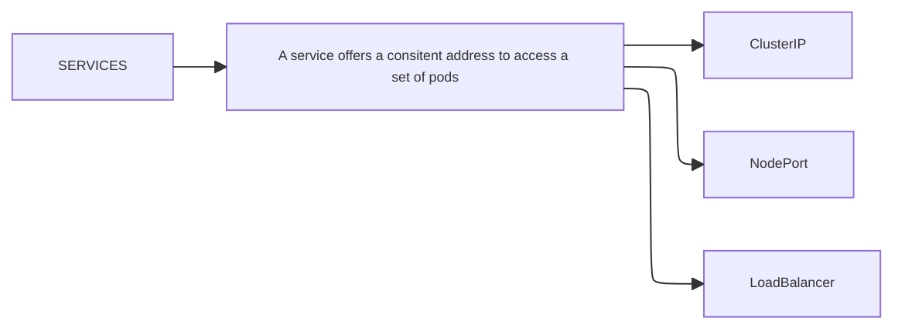

Stell dir vor du hast für unsere Mealie Anwendung 10 Replicas laufen die alle eine IP zugeteilt bekommen und wir skalieren die Anwendung herunter, der Service kümmert sich um das entfernen
zuvieler Pods, ansonsten müssten wir das alles manuell machen müssen.

Oder wir Updaten unser Deployment. Unser Rolling-Update erzeugt neue Pods mit dem neuen
Deployment und entfernt nach und nach die alten Pods, unser Service sorgt aber dafür das unsere Anwendung erreichbar bleibt.

* Pods are ephremal. You should not expect a pod to have a long lifespan
* Pods are constantly changing and beeing moved across nodes
* How will the system keep track of the constantly changing IP Adresses


#### Sobald wir einen Service erstellen, erhält er ...
*  eine Cluster-IP
* einen NodePort (der exposed werden kann)
	* `k get nodes -o wide`
* einen LoadBalancer (wird für cloud provider bspw. Azure  genutzt)




`kubectl get service`

`NAME         TYPE        CLUSTER-IP   EXTERNAL-IP   PORT(S)   AGE`
`kubernetes   ClusterIP   10.43.0.1    <none>        443/TCP   32d`

#### Wie erstellen wir einen neuen Service?

`kubectl expose -h | less`


### Beispiel Service für eine Anwendung die 10 Replicas hat
Wir erstellen uns mal testweise 10 Replicas von einem httpd image  und 
wollen dafür einen Service bereitestellen

##### 1. httpd Deployment *"frontend.yaml"* erstellen
* 
```yaml

apiVersion: apps/v1
kind: Deployment
metadata:
  labels:
    app: frontend
  name: frontend
spec:
  replicas: 10
  selector:
    matchLabels:
      app: frontend
  template:
    metadata:
      labels:
        app: frontend
    spec:
      containers:
        - image: httpd:alpine3.18
          name: httpd
  strategy:
    type: RollingUpdate
    rollingUpdate:
      maxUnavailable: 1
      maxSurge: 1
~

```

##### 2. Deployment ausführen

	 k apply -f frontend.yaml

##### 3. Deployments anzeigen lassen

	k get deployments.apps

##### 4. Service erstellen
	 k expose deployment frontend --port 8080

	kubectl get service -o wide

##### 5. Unser Service hat eine Cluster-IP und ist an unsere Anwendung gebunden

Unser Service hat eine eigene Cluster-IP und als SELECTOR **app=frontend**

Dieser Selector zeigt uns, dass unser Service mit unserer Frontend Anwendung verknüft ist

NAME: frontend
CLUSTER-IP: 10.43.130.186 

Kubernetes DNS kann unseren Service nun auflössen.

	NAME         TYPE        CLUSTER-IP      EXTERNAL-IP   PORT(S)    AGE   SELECTOR
	frontend     ClusterIP   10.43.130.186   <none>        8080/TCP   18s   app=frontend
	kubernetes   ClusterIP   10.43.0.1       <none>        443/TCP    32d   <none>


