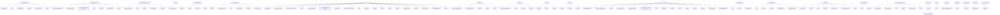

---

## Ablaufdiagramm

```mermaid
flowchart TD

%% Zeile: gda-eafg-init-jobs
A["gda-eafg-init-jobs"] --> B["gda-eafg-api"]
A --> C["api"]
A --> D["authentication"]
A --> E["api-web"]
A --> F["viewer-service"]
A --> G["gitea"]

%% Zeile: apparat-api-service
H["apparat-api-service"] --> I["apparat-metadata-service"]
H --> J["ocelot-api-service"]
H --> K["gda-eafg-leading-code-service"]
H --> L["api"]
H --> M["system"]
H --> N["authentication"]
H --> O["redis"]

%% Zeile: apparat-metadata-service
P["apparat-metadata-service"] --> Q["apparat-api-service"]
P --> R["api"]
P --> S["system"]
P --> T["authentication"]
P --> U["postgres"]

%% Zeile: ocelot
V["ocelot"] --> W["ocelot-api-service"]
V --> X["api-web"]

%% Zeile: ocelot-api-service
Y["ocelot-api-service"] --> Z["ocelot"]
Y --> AA["api-web"]
Y --> AB["redis"]

%% Zeile: gda-eafg-client
AC["gda-eafg-client"] --> AD["ocelot"]
AC --> AE["gda-eafg-init-tenant"]
AC --> AF["api"]
AC --> AG["authentication"]
AC --> AH["api-web"]
AC --> AI["viewer-service"]

%% Zeile: api
AJ["api"] --> AK["gda-eafg-api"]
AJ --> AL["apparat-api-service"]
AJ --> AM["apparat-metadata-service"]
AJ --> AN["ocelot"]
AJ --> AO["gda-eafg-init-tenant"]
AJ --> AP["gda-eafg-leading-code-service"]
AJ --> AQ["pdf-service"]
AJ --> AR["referenceremover-service"]
AJ --> AS["api"]
AJ --> AT["repository"]
AJ --> AU["registry"]
AJ --> AV["index"]
AJ --> AW["search"]
AJ --> AX["system"]
AJ --> AY["renditionservice"]
AJ --> AZ["api-web"]
AJ --> BA["viewer-service"]
AJ --> BB["tenant-management"]
AJ --> BC["redis"]

%% Zeile: repository
BD["repository"] --> BE["apparat-metadata-service"]
BD --> BF["gda-eafg-init-tenant"]
BD --> BG["registry"]
BD --> BH["system"]
BD --> BI["redis"]

%% Zeile: registry
BJ["registry"] --> BK["apparat-metadata-service"]
BJ --> BL["index"]
BJ --> BM["search"]
BJ --> BN["system"]

%% Zeile: index
BO["index"] --> BP["registry"]
BO --> BQ["search"]
BO --> BR["system"]

%% Zeile: search
BS["search"] --> BT["registry"]
BS --> BU["search"]
BS --> BV["system"]

%% Zeile: system
BW["system"] --> BX["apparat-api-service"]
BW --> BY["apparat-metadata-service"]
BW --> BZ["ocelot"]
BW --> CA["ocelot-api-service"]
BW --> CB["gda-eafg-init-tenant"]
BW --> CC["gda-eafg-leading-code-service"]
BW --> CD["api"]
BW --> CE["repository"]
BW --> CF["registry"]
BW --> CG["index"]
BW --> CH["search"]
BW --> CI["system"]
BW --> CJ["api-web"]
BW --> CK["viewer-service"]
BW --> CL["tenant-management"]

%% Zeile: authentication
CM["authentication"] --> CN["api"]
CM --> CO["system"]
CM --> CP["authentication"]

%% Zeile: renditionservice
CQ["renditionservice"] --> CR["api"]
CQ --> CS["registry"]
CQ --> CT["system"]
CQ --> CU["renditionservice"]
CQ --> CV["renditionnetworker"]

%% Zeile: api-web
CW["api-web"] --> CX["gda-eafg-api"]
CW --> CY["ocelot"]
CW --> CZ["api"]
CW --> DA["api-web"]
CW --> DB["viewer-service"]
CW --> DC["tenant-management"]
CW --> DD["redis"]

%% Zeile: viewerservice
DE["viewerservice"] --> DF["api"]
DE --> DG["api-web"]

%% Zeile: tenant-management
DH["tenant-management"] --> DI["gda-eafg-api"]
DH --> DJ["gda-eafg-client"]
DH --> DK["api"]
DH --> DL["system"]
DH --> DM["viewer-service"]
DH --> DN["redis"]

%% Zeile: userservice
DO["userservice"] --> DP["system"]
DP --> DQ["tenant-management"]

%% Infrastruktur
DR["redis"] --> DS["api"]
DT["postgres"] --> DU["apparat-metadata-service"]
DV["rabbitmq"] --> DW["gitea"]
DX["elasticsearch"] --> DY["search"]
DZ["keycloak"] --> EA["authentication"]
EB["storage-provider"] --> EC["repository"]

```

---
